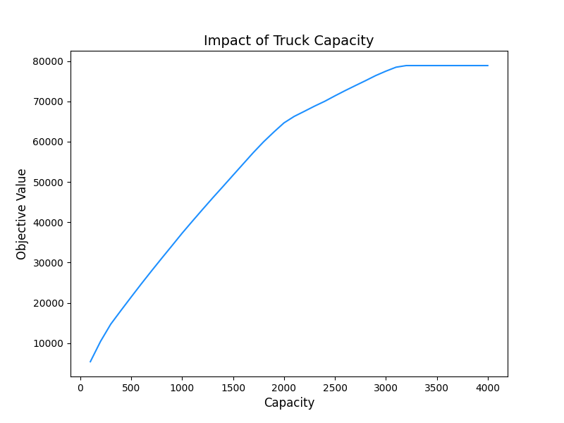

# Processo seletivo - Mercado Livre

## Candidato: 
Isabel de Castro Beneyto

LinkedIn: https://www.linkedin.com/in/castro-isabel/

GitHub: https://github.com/castroisabel

Email: icastrocordeiro@gmail.com e castrobeneyto@gmail.com

## Desafio: Relocação de Bicicletas

### Introdução

A RentalBike é uma empresa de compartilhamento de bicicletas que oferece aluguel de bicicletas de curta duração em várias áreas de uma cidade, com diferentes categorias de bicicletas disponíveis. Os clientes podem alugar bicicletas por qualquer período e devolvê-las em uma área diferente daquela onde as retiraram, desde que seja uma área operada pela RentalBike. Como os clientes podem mover as bicicletas, a empresa precisa redistribuir o excesso de bicicletas entre as diferentes áreas conforme a demanda. Essa decisão de redistribuição é baseada nos lucros esperados para cada volume de bicicletas a serem movidas, exigindo uma otimização antes do processo de realocação.

### Entradas

- Excedente de bicicletas de diferentes categorias na área de origem;
- Constantes para o espaço ocupado por uma bicicleta de cada categoria no caminhão;
- Lucros esperados para relocar bicicletas da área de origem para qualquer outra área.

**Desafio:** Quantas bicicletas de cada categoria devem ser transportadas para cada área de forma que a soma do lucro esperado seja maximizada?

### Pressupostos
1. Os lucros esperados são constantes em relação a cada unidade de bicicletas que podem ser relocadas para outras áreas. Portanto, é um problema de otimização determinística;
2. Neste desafio, apenas uma área é a fonte das bicicletas. Portanto, haverá apenas relocamentos começando desta área.

### Dados
Dados disponíveis na pasta `data` no arquivo: `BicyclesRelocationData.xlsx`

- Uma planilha chamada `Categories` que fornece cada categoria de bicicleta como cabeçalho, e respectivamente, duas linhas de dados:
    1. O excedente de bicicletas disponíveis na área de origem para cada categoria;
    2. Constante para quanto espaço cada categoria de bicicleta ocupa no caminhão. Por exemplo, se uma categoria de bicicleta chamada "Child" tem constante 1 e a categoria "Adult" tem constante 1.5, então uma bicicleta "Adult" ocupa 50% mais espaço no caminhão do que uma bicicleta "Child".

- Planilhas com nomes começando com `ExpectedProfitsArea` e terminando com um número. Esses números indicam qual área de destino é a planilha descrita. Cada uma dessas planilhas tem todas as categorias de bicicletas como cabeçalho e várias linhas de dados. Cada linha apresenta quanto lucro se espera ganhar ao enviar uma bicicleta adicional para aquela área de destino.

#### Características do lucro esperado:
- Os dados de lucros esperados **não são acumulados**;
- Como a demanda pelo compartilhamento de bicicletas varia de acordo com diferentes fatores, o lucro obtido pelo primeiro aluguel de uma bicicleta pode ser maior ou menor do que o lucro obtido pelo segundo aluguel da mesma bicicleta na mesma região;
- O lucro esperado pela relocacão da enésima bicicleta só é obtido se todas as bicicletas anteriores desta mesma categoria e área forem alugadas;
- A única propriedade que os valores de lucro esperado têm é que são números **não negativos**;
- O comprimento dos dados de lucros esperados pode ser diferente do excedente de bicicletas de cada categoria. No caso de não haver dados de lucro esperados para todas as bicicletas excedentes, o lucro pela relocacão de mais bicicletas do que o excedente da categoria deve ser **considerado como zero**.

## Tarefas

### 1. Formule e resolva o problema de otimização:

**a)**. Escreva uma formulação matemática para resolver este problema de otimização, considerando que a capacidade total de espaço do caminhão é representada por uma constante $T$. **Defina as constantes e variáveis**, e descreva as **restrições e a função objetivo** para maximizar a soma dos lucros esperados.

**R:** 
#### Modelagem Matemática
Considere as seguintes variáveis e constantes: 

$x_{i,j,k}$: indica se a $k$-ésima bicicleta da categoria $j$ foi movida da área de origem para a área de destino $i$

$i$: Área de destino;

$j$: Categoria da bicicleta;

$k$: $k$-ésima bicicleta a ser movida;

$a_j$: Disponibilidade de bicicletas na área de origem da categoria $j$;

$s_j$: Espaço que a bicicleta de categoria $j$ ocupa no caminhão;

$l_{i,j,k}$: Lucro esperado na área de destino $i$ devido a relocação da $k$-ésima bicicleta da categoria $j$;

$T$: Capacidade máxima do caminhão.

Considere as seguintes restrições:

Binária:

$x_{i,j,k} \in \{0, 1\}$;

Disponibilidade de bicicletas na área de origem:

$\sum_i \sum_k x_{i,j,k} \leq a_j $;

Capacidade máxima do caminhão:

$\sum_i \sum_j \sum_k x_{i,j,k} \times s_j \leq T$;

Condição relocação sequencial das bicicletas:

$x_{i,j,k} \leq x_{i,j,k-1}$.

A função objetivo para o problema será dada por:

$\max L = \sum_{i} \sum_{j} \sum_{k} l_{i,j,k} \times x_{i,j,k}$

Apesar de usar a variável de decisão $x_{i,j,k}$ para a solução computacional, iremos reportar $x_{i,j} =  \sum_k x_{i,j,k}$ que representa exatamente a resposta que buscamos: quantas bicicletas de cada categoria devem ser realocadas para cada área.

**b)** Escolha uma linguagem de programação e um solucionador (como CBC ou GLPK) para otimizar a formulação que você propõe na tarefa 1 a). Considerando a capacidade do caminhão como $T=80$, resolva o problema e mostre seu código, a solução ótima e o valor objetivo ótimo.

**R:** 

#### Modelagem Computacional
Disponível no arquivo: `src/solver.py` e `notebooks/03.modeling.ipynb`

Solução ótima:

$x_{i,j} = \begin{bmatrix}
1.0 & 0.0 & 0.0 & 0.0 & 0.0 & 0.0 \\\
0.0 & 0.0 & 0.0 & 0.0 & 0.0 & 0.0 \\\
69.0 & 1.0 & 0.0 & 0.0 & 0.0 & 0.0 \\\
7.0 & 0.0 & 0.0 & 0.0 & 0.0 & 0.0 \\\
0.0 & 0.0 & 0.0 & 0.0 & 0.0 & 0.0 \\\
0.0 & 1.0 & 0.0 & 0.0 & 0.0 & 0.0 \\\
0.0 & 0.0 & 0.0 & 0.0 & 0.0 & 0.0 \\
\end{bmatrix} $

Valor objetivo ótimo: $4358.7834$.

**c)** Agora, a empresa RentalBike deseja avaliar o impacto na função objetivo ao utilizar um caminhão com capacidade variada. Variando a capacidade de $T$ de $100$ até $4000$, com incrementos de $100$ (ou seja, $T= [100, 200, 300, ..., 3900, 4000]$. Execute novamente seu modelo de otimização para cada um desses parâmetros. Plote um gráfico com os valores ótimos da função objetivo obtidos para cada valor de $T$. O gráfico deve mostrar a capacidade no eixo $x$ e os valores da função objetivo no eixo $y$.

**R:**

### 2. Resolvendo com algoritmos:

**a)** Voltando à tarefa 1, imagine o mesmo problema, mas sem as restrições referentes à capacidade do caminhão. Ao fazer isso, a otimização pode assumir que o caminhão tem capacidade ilimitada e ignorar a verificação disso. Sabendo disso, implemente um algoritmo que encontre uma boa solução para este problema. É preferível (mas não obrigatório) que seu algoritmo sempre encontre uma solução ótima, tendo o menor tempo e complexidade de espaço possível. Mostre seu código, a melhor solução encontrada e seu valor objetivo.

**R:**
#### Modelagem Computacional

Optamos pelo algoritmo de *Simulated Annealing* para resolver o problema de realocação de bicicletas devido à sua capacidade de explorar diversas soluções, abrangendo diferentes regiões do espaço de solução e evitando convergências prematuras em máximos locais. Além disso, o algoritmo possui parâmetros ajustáveis, como temperatura inicial, taxa de resfriamento e número de iterações, permitindo adaptá-lo às necessidades específicas do problema. Além disso, o Simulated Annealing é relativamente simples de implementar.

Disponível no arquivo: `src/algorithm.py` e `notebooks/05.heuristic.ipynb`

Solução ótima:

$x_{i,j} = \begin{bmatrix}
0.0 & 0.0 & 0.0 & 0.0 & 0.0 & 0.0 \\\
0.0 & 0.0 & 0.0 & 0.0 & 0.0 & 0.0 \\\
91.0 & 92.0 & 111.0 & 93.0 & 100.0 & 106.0 \\\
103.0 & 97.0 & 75.0 & 103.0 & 101.0 & 109.0 \\\
0.0 & 0.0 & 0.0 & 0.0 & 0.0 & 0.0 \\\
78.0 & 81.0 & 93.0 & 71.0 & 81.0 & 64.0 \\\
0.0 & 0.0 & 0.0 & 0.0 & 0.0 & 0.0 \\
\end{bmatrix} $

Valor objetivo ótimo: $78636.7606$.

**b)** Qual é a complexidade de tempo do seu algoritmo? Qual é a complexidade do espaço auxiliar do seu algoritmo?

**R:**

A complexidade de tempo do algoritmo de Simulated Annealing (`simulated_annealing()`) é depende principalmente do número de iterações estabelecidas inicialmente, denominado como $NI$, e portanto possui complexidade de tempo $O(NI)$. Dentro da função, há a chamada para a função `obj_function()` que calcula o lucro esperado e depende da quantidade de áreas $M$ e o número de categorias de bicicletas $N$, portanto $O(N \times M)$.

A função `generate_neighbor()` possui complexidade de tempo $O(1)$, pois executa um número fixo de operações, e a função `sum_supplies()` possui complexidade de tempo $O(M)$, pois percorre todas as categorias.

Porém em `obj_function()` e `sum_supplies()` utilizamos a função nativa do python `sum()` que possui complexidade $O(K)$, onde $K$ é o número de bicicletas alocadas.

Ao final temos a complexidade de tempo: $O(NI) \times O(N \times M) \times O(K)$

**c)** O algoritmo que você propôs na letra **a)** sempre encontrará uma solução ótima, independentemente da entrada? Como?

**R**: 

Não. O Simulated Annealing é um algoritmo que pode encontrar soluções boas para problemas de otimização, mas não garante a solução ótima em todos os casos. O algoritmo faz escolhas aleatórias durante sua execução e pode aceitar soluções piores com uma certa probabilidade, o que permite explorar mais completamente o espaço de soluções em busca de soluções melhores.

**d)** Ao analisar os dados de entrada, quais tarefas de pré-processamento podem ser feitas para esta instância a fim de torná-la mais rápida ou mais leve para ser resolvida?

**R:**

Uma estratégia de pré-processamento que poderia ser explorada para os lucros esperados é substituir o fornecimento do lucro esperado para a alocação da $k$-ésima bicicleta pelo valor do lucro esperado acumulado para as $k$ primeiras bicicletas alocadas em uma área específica $i$ e categoria $j$. Assim, evitariamos ter que realizar a soma dos lucros esperados em cada iteração.

### 3 . Indo além na tarefa 2 (problema sem a restrição de capacidade).

**a)** Como o processamento paralelo pode ser aplicado para reduzir o tempo de execução da resolução deste problema?

**R:** Poderíamos dividir o número total de interações igualmente em diferentes processos paralelos. No final poderíamos armazenar o resultado de todas as execuções paralelas e selecionar a melhor solução com base no valor do lucro esperado. Dessa forma, estaríamos distribuindo o trabalho entre múltiplos núcleos. 

**b)** Se for garantido que o número de bicicletas a serem redistribuídas será sempre pelo menos 90% da demanda esperada para todas as áreas, você pode adaptar seu algoritmo para usar essa propriedade e executar mais rapidamente?

**R:**
Sim, pois ao limitar o espaço de busca à soluções que atendam essa condição, podemos evitar movimentos desnecessários e reduzir o tempo de convergência para uma solução viável. Isso poderia ser feito modificando a função `generate_neighbor()` ou `sum_supplies()` para garantir que a pertubação gerada sempre atenda a a restrição de que o número de bicicletas redistribuidas seja de pelo menos 90% da demanda esperada para todas as áreas.

**c)** Agora, a empresa RentalBike deseja evitar a realocação para uma área que não seja priorizada, a menos que outras regiões estejam razoavelmente atendidas. O que deve ser alterado ou incluído na formulação que você propôs, na Tarefa **1 a)**, para garantir que a área número 1 receberá uma bicicleta apenas se pelo menos 85% do excedente de cada categoria já estiver alocado para outras áreas?

**R:** 

Neste cenário, é necessário adicionar uma nova restrição:

$\sum_{i \neq 1} \sum_k x_{i,j,k} \geq 0.85 \times a_j$ $\forall j$.

Assim garantimos que, para cada categoria $j$, temos $85%$ do excedente alocado em outras áreas diferentes da área $1$.

**d)** Agora, a RentalBike deseja equilibrar os lucros entre as áreas. O que deve ser alterado em sua formulação para maximizar os lucros esperados da região com os menores lucros esperados, em vez de simplesmente maximizar a soma dos lucros?

**R:**

Seja $L_i$ o lucro esperado da área $i$, então temos que o menor lucro esperado entre todas as áreas será $L_{min}$ e $i_{min}$ corresponde ao índice da área com os menores lucros esperados.

A nova função objetivo deve ser ajustada como:

$\max L_{min} = \max \sum_{j} \sum_{k} l_{i_{min},j,k} \times x_{i_{min},j,k}  $.

### 4 . Indo mais além no negócio.

**a)** Quais outras análises, otimizações ou políticas você sugere para a RentalBike que poderiam trazer impacto comercial?

**R:** 

- Identificar o impacto das rotas de distribuição das bicicletas, pensando na redistribuição mais otimizada entre as áreas.

- Realizar análises preditivas pensando em demandas futuras de bicicletas em diferentes áreas da cidade. Pensando em se beneficiar de padrões sazonais e eventos locais.

- Projetar um esquema de pontuação para os usuários com base na área de destino da bicicleta. Assim poderíamos atribuir mais pontos para devoluções em áreas estratégicas.

- Incentivar os usuários a alugarem bicicletas de categorias com alta disponibilidade em áreas específicas para equilibrar a disponibilidade. Esse incentivo pode ser por meio de descontos, maior tempo de duração para a categoria em questão, etc.